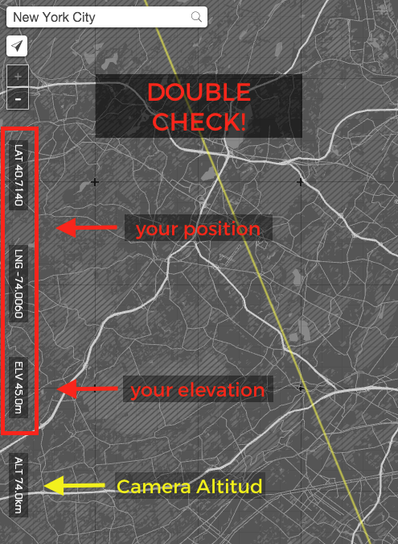
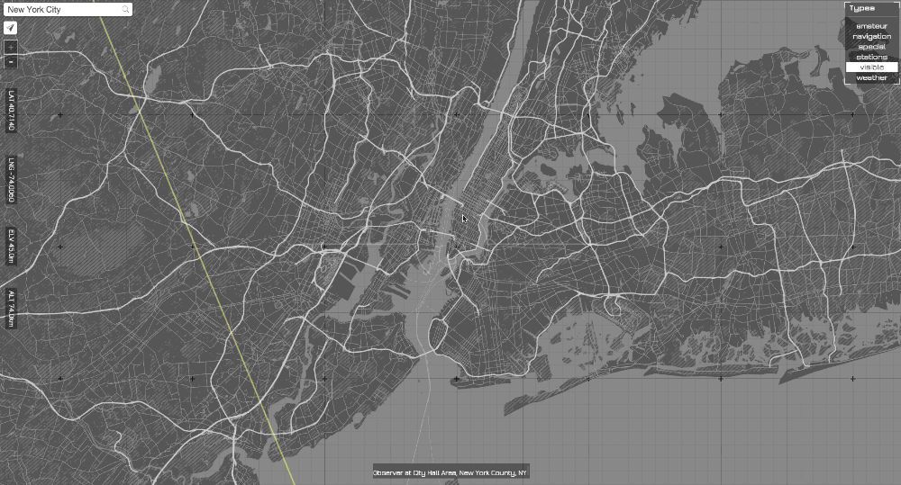
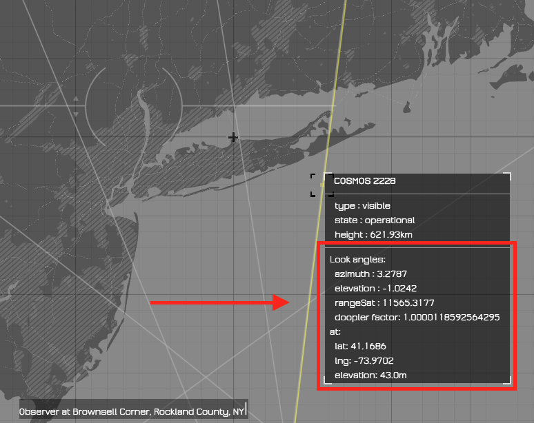

# Line of Sight

See what satellites are in your line of sight.

## How it works?

- Go to the area you are interested in. You can do that by panning, clicking on the auto-location button or searching for a city.

- Double check your position and elevation

- Zoom out until you see the satellites' orbits and hover over them

 - By clicking on the orbits or waiting a second, more information will show telling you what are the angles (azimuth and elevation) you should look at. Together with some information about the range and doppler factor.

## Resources

This project was made 100% using open software and data.

Libraries:

* [Leaflet](http://leafletjs.com/): JavaScript library for interactive maps
* [Tangram](https://mapzen.com/projects/tangram): 2D/3D WebGL map engine
* [Satellite-js](https://github.com/shashwatak/satellite-js) for predicting the ISS orbit.

Data sources:
* [OpenStreetMap](http://www.openstreetmap.org/): vector tile data
* [CelesTrak](http://www.celestrak.com/NORAD/elements/master.asp) satellite codes
* [Mapzen’s vector tiles](https://mapzen.com/projects/vector-tiles)
* [Mapzen’s elevation data](https://mapzen.com/documentation/elevation/elevation-service/)
* [Mapzen’s geo search](https://mapzen.com/projects/search)
* [SatNOGS transmitters for satellite](https://satnogs.org/)

## Install a local version of this project

Start a web server in the repo’s directory:

    python -m SimpleHTTPServer 8000
    
If that doesn’t work, try:

    python -m http.server 8000
    
Then navigate to: [http://localhost:8000](http://localhost:8000)

## About the author

**Patricio Gonzalez Vivo** (Buenos Aires, 1982) is a New York based artist and engineer. He explores interstitial spaces between organic and synthetic, analog and digital, individual and collective.

Patricio studied and practiced psychotherapy and expressive art therapy. He holds an MFA in Design & Technology from Parsons The New School, where he now teaches. Currently he works as a Graphic Engineer at Mapzen making open-source mapping tools.
